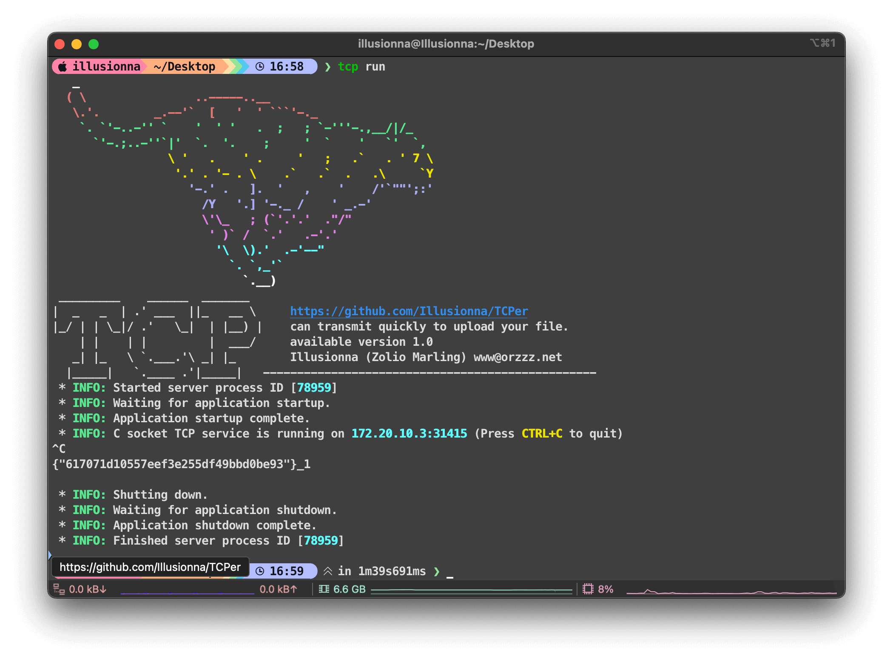
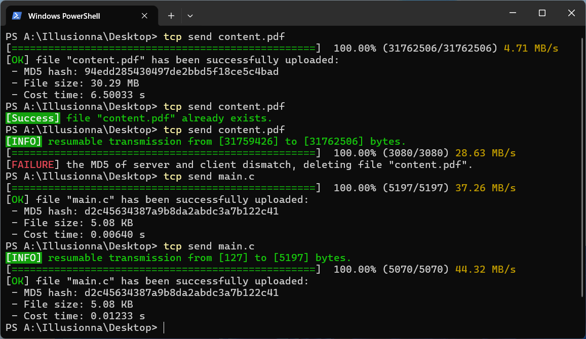

<h1 align="center">
    <a href="https://github.com/Illusionna/TCPer" target="_blank"></a>
    <a style="color: #008000;"><b>TCPer</b></a>
</h1>

<h4 align="center"><span>English</span>&nbsp;&nbsp;&nbsp;&nbsp; | &nbsp;&nbsp;&nbsp;&nbsp;<a href="README_zh-CN.md" target="_blank">中文</a></h4>

# Screenshot

<div align=center>
    
    
</div>

# 🚀 TCPer: Cross-Platform File Transmission Tool

TCPer is a **lightweight**, **high-performance** file transmission tool written in C. It is not just a simple `Socket` wrapper; it is a data courier with the soul of TCP and the speed of a rocket.

> "Runs like UDP, stays reliable like TCP"

# ✨ Features

- 🛡️ **Ironclad Reliability**: Automatically performs `MD5` integrity checksums. If the received file doesn't match the original, the server rejects it and cleans up the directory.

- ⏯️ **Resumable Transmission**: Even if the network hiccups, TCPer can resume transmission from the last interrupted offset upon reconnection, refusing to start from zero.

- ⚡ **Thread-Pool Driven**: The server utilizes a high-efficiency `thread pool` design to handle multiple client requests simultaneously.

- 🎨 **Terminal CLI**: Features a vibrant ASCII Art identity and a dynamic progress bar that tracks speed, percentage, and size in real-time.

- 📂 **Smart Storage**: Automatically organizes incoming files into the `tcp-storage` directory with built-in path-traversal protection using os_basename.

- 🌐 **Cross-Platform DNA**: Modular design with abstraction layers, allowing seamless compilation and execution on `Windows`, `macOS`, and `Linux`.

# 🐧 Cross-Platform Support

<div align="center">

| OS | Threading | Socket API |
| :-: | :-: | :-: |
| macOS | POSIX Threads| Berkeley Sockets |
| Windows | WIN32 API | Winsock2 |
| Linux | POSIX Threads | Berkeley Sockets |

</div>

# 🛠️ Quick Start

## Dependencies

> MinGW GCC：https://github.com/niXman/mingw-builds-binaries

```bash
(macOS) >>> gcc --version

Apple clang version 15.0.0 (clang-1500.3.9.4)
Target: arm64-apple-darwin23.6.0
Thread model: posix
InstalledDir: /Library/Developer/CommandLineTools/usr/bin

(macOS) >>> make --version

GNU Make 3.81
Copyright (C) 2006  Free Software Foundation, Inc.
This is free software; see the source for copying conditions.
There is NO warranty; not even for MERCHANTABILITY or FITNESS FOR A
PARTICULAR PURPOSE.
This program built for i386-apple-darwin11.3.0
```

```bash
(Windows) >>> gcc --version

gcc.exe (x86_64-posix-seh-rev0, Built by MinGW-Builds project) 15.2.0
Copyright (C) 2025 Free Software Foundation, Inc.
This is free software; see the source for copying conditions.  There is NO
warranty; not even for MERCHANTABILITY or FITNESS FOR A PARTICULAR PURPOSE.

(Windows) >>> make --version

GNU Make 4.4.1
Built for x86_64-w64-mingw32
Copyright (C) 1988-2023 Free Software Foundation, Inc.
License GPLv3+: GNU GPL version 3 or later <https://gnu.org/licenses/gpl.html>
This is free software: you are free to change and redistribute it.
There is NO WARRANTY, to the extent permitted by law.
```

```bash
(Linux) >>> gcc --version

gcc (Ubuntu 11.4.0-1ubuntu1~22.04.2) 11.4.0
Copyright (C) 2021 Free Software Foundation, Inc.
This is free software; see the source for copying conditions.  There is NO
warranty; not even for MERCHANTABILITY or FITNESS FOR A PARTICULAR PURPOSE.

(Linux) >>> make --version

GNU Make 4.3
Built for x86_64-pc-linux-gnu
Copyright (C) 1988-2020 Free Software Foundation, Inc.
License GPLv3+: GNU GPL version 3 or later <http://gnu.org/licenses/gpl.html>
This is free software: you are free to change and redistribute it.
There is NO WARRANTY, to the extent permitted by law.
```

## Download

```bash
git clone https://github.com/Illusionna/TCPer.git
```

## Compile

```bash
# Use 4 threads to accelerate compilation.
make -j4
```

## Run

```bash
# Start the server on the machine receiving the file.
./tcp run [port]
```

## Configure

```bash
# Tell the client where the server is located. Format "tcp config [ipv4:port]".
./tcp config 192.168.1.100:31415
```

```bash
# To view current configuration.
./tcp config
```

## Send

```bash
# Transmit a file from the client to the server.
./tcp send ./Desktop/Illusionna/demo.pdf
```

# 🔍 Technical Highlights

- Optimized `I/O`: Leverages `BUFFER_CAPACITY` for large file read/write operations and disables the Nagle algorithm (`TCP_NODELAY`) to reduce latency.

- Secure Handshake: Includes a `token verification` mechanism. If an unauthorized browser attempts to access your port, TCPer serves a dummy HTML page as a disguise.

- Dynamic Unit Conversion: Automatically converts raw bytes into human-readable B, KB, MB, or GB for the progress display.

- Asynchronous Logging: High-performance logging system to track server-side behaviors.

# License

> [MIT](LICENSE) © Zolio Marling
